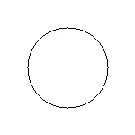
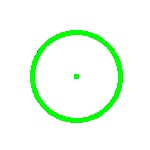

# circle_detection

`pip install -r requirements.txt`

### Run code

`python circle_detection.py --image sample_images/1.jpg`

 

### Here (50,50) is the pixel coordinate we need to check inside or outside the circular
region,If a circular region is present

`python circle_detection.py --image sample_images/4.jpg --point 50,50`
