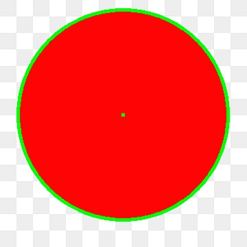
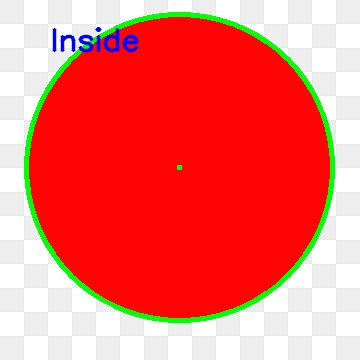

# circle_detection

### Sample output

### Circle detection

 

### Check the coordinate inside or outside

 

## How to use

1. Fork this repo
2. Install required packages from `pip install -r requirements.txt`
3. Execute the `python circle_detection.py --image sample_images/4.jpg` file.

### Check the pixel coordinate (50,50) inside or outside the circular region,If a circular region is present or not.

4. Execute the `python circle_detection.py --image sample_images/4.jpg --point 50,50` file.
